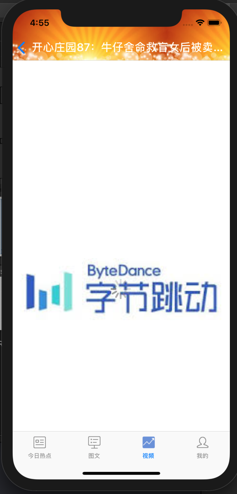
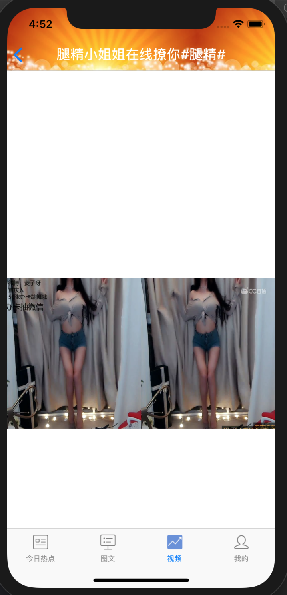
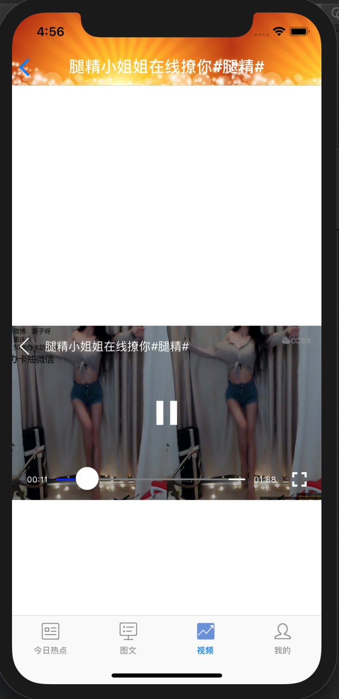
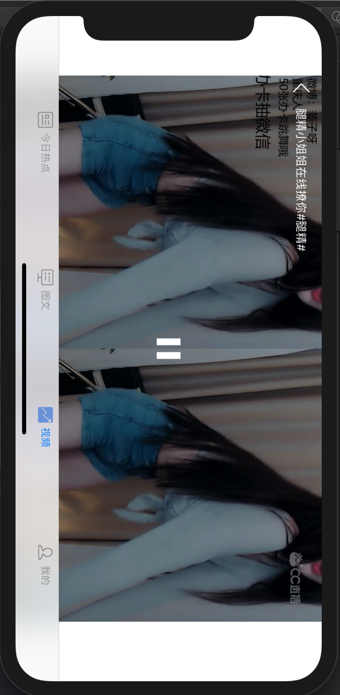

### IOS科研实训最终成果报告

#### 小组成员与指导老师

| 姓名   | 学号     | 指导老师 |
| ------ | -------- | -------- |
| 王亮岛 | 16340219 | 郑贵锋   |
| 王晶   | 16340217 | 郑贵锋   |
| 曲翔宇 | 15335124 | 郑贵锋   |
| 彭伟林 | 16340181 | 郑贵锋   |

#### 项目实现功能与介绍

本项目是基于feed信息流的新闻展示APP，使用objective-c语言开发，运行环境是IOS操作系统，主要功能如下：

- 新闻列表展示
- 新闻详情展示
- 新闻搜索功能
- 评论功能
- 收藏功能
- 用户登录与注册，用户信息编辑
- 收藏功能
- 视频列表展示
- 视频播放功能

#### 功能截图

<table>
  <tr>
    <td>新闻列表</td>
    <td></td>
    <td></td>
    <td></td>
  </tr>
</table>

<table>
  <tr>
    <td>视频播放页</td>
    <td></td>
    <td></td>
    <td></td>
  </tr>
</table>

#### 功能设计介绍

##### 新闻详情页

这部分主要分为两个部分，一个是使用今日头条给的API显示新闻内容，使用js调整图片大小，使用css渲染文本，使新闻详情能更好看的显示。在这一部分遇到的问题是需要使用正则表达式获取到图片的链接，然后与html文本合并显示，使用的正则表达式函数如下：

```objective-c
-(NSArray *) filterString:(NSString *)html{
    NSMutableArray *resultArray = [NSMutableArray array];
    
    NSRegularExpression *regex = [NSRegularExpression regularExpressionWithPattern:@"<(img|IMG)(.*?)(/>|></img>|>)" options:NSRegularExpressionAllowCommentsAndWhitespace error:nil];
    NSArray *result = [regex matchesInString:html options:NSMatchingReportCompletion range:NSMakeRange(0, html.length)];
    
    for (NSTextCheckingResult *item in result) {
        NSString *imgHtml = [html substringWithRange:[item rangeAtIndex:0]];
        
        NSArray *tmpArray = nil;
        if ([imgHtml rangeOfString:@"= 2) {
            NSString *src = tmpArray[1];
            
            NSUInteger loc = [src rangeOfString:@">"].location;
            if (loc != NSNotFound) {
                src = [src substringToIndex:loc];
                if ([src containsString:@"{{image_domain}}"]) {
                    [resultArray addObject:src];
                }
            }
        }
    }
    
    return resultArray;
}
```

然后使用wkWebView的loadHTMLString方法载入html文本和css的渲染样式。

然后是详情中显示大图的方法，使用的是wkWebView的代理，添加js点击事件：

```objective-c
- (void)showBigImage:(NSURLRequest *)request {
    NSString *str = request.URL.absoluteString;
    if ([str hasPrefix:@"myweb:imageClick:"]) {
        NSString *imageUrl = [str substringFromIndex:@"myweb:imageClick:".length];
        NSArray *imgUrlArr = [self.wkWebView getImgUrlArray];
        NSInteger index = 0;
        for (NSInteger i = 0; i < [imgUrlArr count]; i++) {
            if([imageUrl isEqualToString:imgUrlArr[i]]){
                index = i;
            }
        }
        NSNumber* Index = [[NSNumber alloc] initWithInteger:index];
        PicDetailController* pc = [[PicDetailController alloc] initWithPicModel:imgUrlArr PicIndex: Index];
        [self.navigationController pushViewController:pc animated:YES];
    }
    
}
```

在这个函数中会创建一个PicDetailController的对象，进行跳转，在这个类里面，使用的是MWPhotoBrowser第三方库的代理进行图片的展示：

```objective-c
#pragma mark - <MWPhotoBrowserDelegate>
- (NSUInteger)numberOfPhotosInPhotoBrowser:(MWPhotoBrowser *)photoBrowser {
    return self.imgURL.count;
}
- (id<MWPhoto>)photoBrowser:(MWPhotoBrowser *)photoBrowser photoAtIndex:(NSUInteger)index {
    MWPhoto *photo = [MWPhoto photoWithURL:[NSURL URLWithString:self.imgURL[index]]];
    return photo;
}

```

##### 评论界面的实现

在新闻详情页面的最下方会有输入框和各种按钮，分别是收藏，查看评论。其中查看评论是使用动画来实现，在点击查看评论按钮之后会改变评论页面的布局，让其显示出来，而改变布局这一过程使用动画来过渡。

```objective-c
//展示从底部向上弹出的UIView（包含遮罩）
- (void)showInView:(UIView *)view {
    if (!view) {
        return;
    }
    [self updateComment];
    NSLog(@"comment: %@", self.comments);
    [self setupContent];
    [view addSubview:self];
    [view addSubview:_contentView];
    
    [_contentView setFrame:CGRectMake(0, kWindowH, kWindowW, viewHeight)];
    
    [UIView animateWithDuration:0.3 animations:^{
        
        self.alpha = 1.0;
        
        [_contentView setFrame:CGRectMake(0, kWindowH - viewHeight - UI_navBar_Height, kWindowW, viewHeight)];
        
    } completion:nil];
}

//移除从上向底部弹下去的UIView（包含遮罩）
- (void)disMissView {
    
    [_contentView setFrame:CGRectMake(0, kWindowH - viewHeight, kWindowW, viewHeight)];
    [UIView animateWithDuration:0.3f
                     animations:^{
                         
                         self.alpha = 0.0;
                         
                         [_contentView setFrame:CGRectMake(0, kWindowH, kWindowW, viewHeight)];
                     }
                     completion:^(BOOL finished){
                         
                         [self removeFromSuperview];
                         [_contentView removeFromSuperview];
                         
                     }];
    
}
```

因为我们的评论内容是使用后台数据库来存储的，因此需要使用url获取后台的数据库的内容，但是这一过程会有时间的延迟，获取数据和界面的显示是异步的，因此我会将评论的显示延迟几秒再显示界面，并不会给用户带来不好的体验。

```objective-c
- (void)methodOnePerformSelector{
    [self performSelector:@selector(delayMethod) withObject:nil/*可传任意类型参数*/ afterDelay:0.5];
}
- (void)delayMethod{
    self.jumpView.comments = self.comments;
    NSLog(@"comments:%@",self.jumpView.comments);
    [self.jumpView showInView:self.view];
    [self.jumpView updateContent];
}
```

对于评论界面的设计，使用的是UITableView来展示信息，但是每一个cell的样式是我们自己定义的，每一个评论需要展示评论时间，用户名，用户头像，评论信息。因此需要分配好这几个内容的位置，使用的是Masonry第三方库编辑组件的位置。另一方面，考虑到用户需要登陆才能实现评论的设定，我在点击评论提交的按钮处设计了判断用户名是否为空的条件，如果为空则显示先登录的提示，同时不能提交评论。在这里，因为提交评论和获取评论相当于有两个延迟，因此我使用两个不同的延迟函数实现，延迟的时间不一样，尽可能的短以改善用户体验。

##### 新闻搜索功能

使用的是第三方库PYSearch，这个库提供了显示历史记录，查找匹配新闻的设计，只需要实现响应的代理函数即可：

```objective-c
-(void)searchButton{
    NSArray *hotSeaches = @[@"NBA", @"科技", @"民生", @"游戏", @"小说", @"音乐", @"影视"];
    PYSearchViewController *searchViewController = [PYSearchViewController searchViewControllerWithHotSearches:hotSeaches searchBarPlaceholder:NSLocalizedString(@"搜索新闻", @"搜索新闻") didSearchBlock:^(PYSearchViewController *searchViewController, UISearchBar *searchBar, NSString *searchText) {
        HomeDetailController* controller = [[HomeDetailController alloc] init];
        for (int i=0; i<self.articleList.count; i++) {
            if ([self.articleList[i][@"title"] containsString:searchText]) {
                controller.groupId = self.articleList[i][@"group_id"];
            }
        }
        [searchViewController.navigationController pushViewController:controller animated:YES];
    }];
    searchViewController.searchHistoryStyle = PYHotSearchStyleDefault;
    searchViewController.delegate = self;
    searchViewController.searchViewControllerShowMode = PYSearchViewControllerShowModePush;
    [self.navigationController pushViewController:searchViewController animated:YES];
}

- (void)searchViewController:(PYSearchViewController *)searchViewController searchTextDidChange:(UISearchBar *)seachBar searchText:(NSString *)searchText
{
    [self update];
    if (searchText.length) {
        
        // Simulate a send request to get a search suggestions
        dispatch_after(dispatch_time(DISPATCH_TIME_NOW, (int64_t)(0.25 * NSEC_PER_SEC)), dispatch_get_main_queue(), ^{
            NSMutableArray *searchSuggestionsM = [NSMutableArray array];
            for (int i=0; i<self.articleList.count; i++) {
                if ([self.articleList[i][@"title"] containsString:searchText]) {
                    [searchSuggestionsM addObject: self.articleList[i][@"title"]];
                }
            }
            // Refresh and display the search suggustions
            searchViewController.searchSuggestions = searchSuggestionsM;
        });
    }
}
```

这个功能不难实现，主要是使用containString的方法来匹配字符串，因为我比较的是新闻标题，因此只需要输入新闻的标题的部分内容就可以找到与之匹配的新闻标题，点击之后可以使用pushViewController跳转到对应的详情页面，使用的是新闻对应的groupid匹配到对应的新闻详情。

##### 收藏界面

简单的使用一个UITableView来实现，这里用到的是本地二进制文件存储的设计，并没有存储到后台数据库的打算，每次添加收藏的新闻之后就会调用二进制编码存储进文件中，然后显示的时候使用二进制界面再读取出来：

```objective-c
#pragma mark 获取沙盒地址

-(NSString*)documentsDirectory{
    
    NSArray *paths = NSSearchPathForDirectoriesInDomains(NSDocumentDirectory, NSUserDomainMask, YES);
    NSString *documentsDirectory = [paths firstObject];
    
    return documentsDirectory;
}

-(NSString*)dataFilePath{
    
    return [[self documentsDirectory]stringByAppendingPathComponent:@"Collections.plist"];
}
//保存文件
-(void)saveChecklists{
    
    NSMutableData *data = [[NSMutableData alloc]init];
    NSKeyedArchiver *archiver = [[NSKeyedArchiver alloc]initForWritingWithMutableData:data];
    
    [archiver encodeObject:self.myCollectList forKey:@"Collections"];
    [archiver finishEncoding];
    
    [data writeToFile:[self dataFilePath] atomically:YES];
    
    
}
//读取文件
-(void)loadChecklists{
    
    NSString *path = [self dataFilePath];
    NSLog(@"path: %@", path);
    if([[NSFileManager defaultManager]fileExistsAtPath:path]){
        
        NSData *data = [[NSData alloc]initWithContentsOfFile:path];
        NSKeyedUnarchiver *unarchiver = [[NSKeyedUnarchiver alloc]initForReadingWithData:data];
        
        self.myCollectList = [unarchiver decodeObjectForKey:@"Collections"];
        
        [unarchiver finishDecoding];
    }else{
        
        self.myCollectList = [[NSMutableArray alloc]initWithCapacity:100];
    }
    
}
```

还使用了一个代理方法：

```objective-c
- (void)tableView:(UITableView *)tableView commitEditingStyle:(UITableViewCellEditingStyle)editingStyle forRowAtIndexPath:(NSIndexPath *)indexPath{
    [self.newsCollects.myCollectList removeObjectAtIndex:indexPath.row];
    
    NSArray *indexPaths = @[indexPath];
    [tableView deleteRowsAtIndexPaths:indexPaths withRowAnimation:UITableViewRowAnimationAutomatic];
    [self.newsCollects saveChecklists];
}
```

这个tableView的代理方法的作用是可以在收藏列表中左滑删除收藏的新闻。

##### 关于用户信息页

这个页面主要是布局的设计，使用的是Masonry进行按钮，背景图等的布局。

这里比较值得关注的功能是缓存清理，主要的设计就是找到缓存文件，然后删除其中的内容，这里使用到了多线程异步处理，在主线程中显示缓存文件大小，然后异步处理缓存清理，这样就可以实时显示缓存的数据：

```objective-c
/** 清理缓存 */
- (void)cleanCaches {
    UIAlertController *ac = [UIAlertController alertControllerWithTitle:@"清理缓存" message:@"" preferredStyle:UIAlertControllerStyleAlert];
    UIAlertAction *cancelAction = [UIAlertAction actionWithTitle:@"取消" style:UIAlertActionStyleCancel handler:^(UIAlertAction * _Nonnull action) {
        return;
    }];
    UIAlertAction *ensureAction = [UIAlertAction actionWithTitle:@"确定" style:UIAlertActionStyleDefault handler:^(UIAlertAction * _Nonnull action) {
        dispatch_async(dispatch_get_global_queue(DISPATCH_QUEUE_PRIORITY_DEFAULT, 0), ^{
            NSString *cachePath = NSSearchPathForDirectoriesInDomains(NSCachesDirectory, NSUserDomainMask, YES).firstObject;
            NSFileManager *manager = [NSFileManager defaultManager];
            NSArray *files = [manager subpathsAtPath:cachePath];
            for (NSString *p in files) {
                NSError *error = nil;
                NSString *path = [cachePath stringByAppendingPathComponent:p];
                if ([manager fileExistsAtPath:path]) {
                    [manager removeItemAtPath:path error:&error];
                }
            }
            dispatch_async(dispatch_get_main_queue(), ^{
                [self.tableView reloadData];
            });
        });
        [self showSuccessWithMsg:@"清理成功"];
        NSLog(@"%@", self.tempUsername);
        if(![self.tempUsername isEqualToString:@""]) {
            [InfoManager saveInfo:self.tempUsername image:self.tempImage];
        }
    }];
    [ac addAction:cancelAction];
    [ac addAction:ensureAction];
    [self presentViewController:ac animated:YES completion:nil];
}
```

##### 自动登录

在初步的版本，我们前端并没有考虑得那么多，只是将简单的UI给设计出来，但由于实际的需求，用户不可能每次打开app都要重新登录，为了提高用户的体验，我们决定添加用户登录功能，这个过程也是我们学习到的理论知识真正运用到实际的开发当中的一个应用。在这里，我们用到cookie对用户的登录状态进行管理。

在登录以后，将服务器传来的cookie设置在本地，并将有效字段提取出来保存在单例当中

```objc
NSURLSessionDataTask* dataTask = [manager dataTaskWithRequest:formRequest uploadProgress:nil downloadProgress:nil completionHandler: ^(NSURLResponse*_Nonnull response,id _Nullable responseObject,NSError*_Nullable error){
    if(error) {
        NSLog(@"Error: %@", error);
        return;
    }
    NSLog(@"%@", responseObject);
    NSString *imagePath = @"";
    NSInteger code = [responseObject[@"code"] integerValue];
    if(code == 200) {
        if([responseObject[@"data"][@"iconpath"] isEqual:[NSNull null]]) {
            [InfoManager saveInfo:@"username" image: @""];
        } else {
            NSString *url = responseObject[@"data"][@"iconpath"];
            NSLog(@"%@", url);
            imagePath = [@"http://172.19.3.119:8080/" stringByAppendingString:url];
            [InfoManager saveInfo:@"username" image: imagePath];
            NSLog(@"lll");
        }
        [self.navigationController popViewControllerAnimated:YES];
        [[NSNotificationCenter defaultCenter] postNotificationName:@"userInfo" object:self userInfo:@{@"type": @"login", @"username": username, @"image": imagePath}];
    } else {
        [self showAlertMessage:@"登陆失败！"];
    }

}];

[dataTask resume];
```

当再次打开app的时候，通过cookie获取token来向服务器请求用户数据，在cookie有效期内可以实现自动登录，并将用户信息拉取到本地，否则需要重新登录

```objc
- (void) checkCookie {
    //通过remeberMe拉取用户信息
     NSHTTPCookieStorage *cookieJar = [NSHTTPCookieStorage sharedHTTPCookieStorage];
     for (NSHTTPCookie *cookie in [cookieJar cookies]) {
         // NSLog(@"%@", cookie.name);
         if([cookie.domain isEqualToString:@"172.19.3.119"] && [cookie.name isEqualToString:@"rememberMe"]) {
             NSString *remeberMe = cookie.value;
             //请求用户信息
             NSMutableURLRequest* formRequest = [[AFHTTPRequestSerializer serializer] requestWithMethod:@"POST" URLString:@"http://172.19.3.119:8080/userinfo/getUserInfo/" parameters:nil error:nil];
             [formRequest addValue:@"application/x-www-form-urlencoded"forHTTPHeaderField:@"Content-Type"];
             [formRequest addValue:remeberMe forHTTPHeaderField:@"rememberMe"];
             AFHTTPSessionManager* manager = [AFHTTPSessionManager manager];
             AFJSONResponseSerializer* responseSerializer = [AFJSONResponseSerializer serializer];
             [responseSerializer setAcceptableContentTypes:[NSSet setWithObjects:@"application/json",@"text/json",@"text/javascript",@"text/html",@"text/plain",nil]];
             manager.responseSerializer= responseSerializer;
             NSURLSessionDataTask* dataTask = [manager dataTaskWithRequest:formRequest uploadProgress:nil downloadProgress:nil completionHandler: ^(NSURLResponse*_Nonnull response,id _Nullable responseObject,NSError*_Nullable error){
                 NSLog(@"%@", responseObject);
                 if(error) {
                     NSLog(@"Error: %@", error);
                     [InfoManager cleanInfo];
                     return;
                 }
                 NSInteger code = [responseObject[@"code"] integerValue];
                 if(code == 200) {
                     //[self showAlertMessage:@"获取成功！"];
                     //NSLog(@"%@", responseObject);
                     if([responseObject[@"data"][@"userinfo"][@"iconpath"]isEqual:[NSNull null]]) {
                         [self.myBtn setBackgroundImage:[UIImage imageNamed:@"login_portrait_ph"] forState:UIControlStateNormal];
                         [InfoManager saveInfo:responseObject[@"data"][@"userinfo"][@"username"] image:@""];
                     } else {
                         NSString *url = responseObject[@"data"][@"userinfo"][@"iconpath"];
                         NSString *imagePath = [@"http://172.19.3.119:8080/" stringByAppendingString:url];
                         [InfoManager saveInfo:responseObject[@"data"][@"userinfo"][@"username"] image:imagePath];
                         //set UI, 没有图片的时候默认
                         [self.myBtn setBackgroundImage:[self getImageFromURL:imagePath] forState:UIControlStateNormal];
                     }
                     self.label.text = responseObject[@"data"][@"userinfo"][@"username"];
                     self.isLogin = true;
                 } else {
                     [self showAlertMessage:@"获取失败！"];
                     [InfoManager cleanInfo];
                     self.isLogin = false;
                 }
             }];
             [dataTask resume];
        } else {
            self.isLogin = false;
            [self.myBtn setBackgroundImage:[UIImage imageNamed:@"login_portrait_ph"] forState:UIControlStateNormal];
            self.label.text = @"登陆/注册";
            [InfoManager cleanInfo];
        }
    }
}
```

每次需要向服务器请求数据的时候，通过单例获取到用户信息

```objc
- (void)jumpToLogin{
    if(!([InfoManager getUsername] == nil)) {
        [self showAlertMessage:@"你已经登陆!"];
    } else {
        RegisterLoginController *controller = [[RegisterLoginController alloc] init];
        controller.hidesBottomBarWhenPushed = YES;
        [self.navigationController pushViewController:controller animated:YES];
    }
}
```

在需要手动登录的情况下，通过通知的方式传递页面信息

```objc
[[NSNotificationCenter defaultCenter] postNotificationName:@"userInfo" object:self userInfo:@{@"type": @"login", @"username": username, @"image": imagePath}];
```

```objc
//注册通知
[[NSNotificationCenter defaultCenter] addObserver:self selector:@selector(getInfo:) name:@"userInfo" object:nil];
```

##### 首页信息展示

首页信息展示其实实现起来非常简单，就是一个简单的UITableView来展示新闻信息，但这里其实是可以有很多可以优化的地方来提高用户体验的，但由于头条提供的api的拉取信息的部分限制比较大，对于随机拉取或者推荐这些做起来难道会比较大。

- 针对cell本身的优化

  首先是针对UITableViewCell的设计，对拉取到的新闻信息的标题进行分析，我们大致可以将cell设计成下面三种格式：

  - 无图：拉取到的新闻的标题仅仅包含文字的情况下使用。
  - 单图：拉取到的新闻标题包含1张图或者2张图的情况下使用。
  - 多图：拉取到的新闻标题包含3张图或者以上的情况下使用。

  由于每条新闻标题文字的长度会不一样，有些标题显示需要占1行，有些标题则需要占2行，显然，设计成一种固定高度的cell是不合适的，所以我们添加了一个自适应的功能，cell可以更加需要显示内容的多少来确定cell的高度，但这样设计又会存在另外一个问题，那就是高度的计算，由于每次显示cell的时候都需要计算一下cell的高度，这个计算的过程会影响到渲染cell的效率，为了解决这个问题，我根据UItableView渲染的生命周期的特点，在cell初次计算出cell的高度的时候，我就把cell的高度缓存起来，在再次显示的时候不用再次计算，减少了重复的计算。具体是在heightForRowAtIndexPath代理方法中设置UITableViewAutomaticDimension可以进行高度自适应，条件是cell的布局使用AutoLayout，如果高度已经被缓存，那么就直接取，否则就计算高度。

  ```objc
  NSMutableArray *temp = [[NSMutableArray alloc]initWithArray:self.articleList];
  NSMutableArray *tempHeight = [[NSMutableArray alloc]initWithCapacity:articleFeed.count];
  [temp addObjectsFromArray:articleFeed];
  [self.cacheHeight addObjectsFromArray:tempHeight];
  self.articleList = temp;
  ```

  ```objc
  -(CGFloat)tableView:(UITableView *)tableView heightForRowAtIndexPath:(NSIndexPath *)indexPath
  {
      return [self.cacheHeight[indexPath.row] floatValue]?:UITableViewAutomaticDimension;
  }
  ```

  同时在estimatedHeightForRowAtIndexPath代理方法中设置一个估计的高度

  ```objc
  -(CGFloat)tableView:(UITableView *)tableView estimatedHeightForRowAtIndexPath:(NSIndexPath *)indexPath
  {
      return 100;
  }
  ```

- 针对滑动时用户体验的优化

  在默认的UITableView的实现当中，只有当用户拉取到最后一行的时候才会触发拉取更多的实现，但是这样的用户体验非常的差，因为刷新后需要从网络当中拉取用户数据，网络时延有时候是让人难以接受的。为了解决这个问题，我在UITableView滑动的时候增加了一个判断，在已经拉取的数据并且还未展示的数据不足以显示下一屏的时候，我会从网络拉取一次新的数据，这样用户就可以一直滑动，基本不会感受到网络的时延。

  ```objc
  - (UITableViewCell *)tableView:(UITableView *)tableView cellForRowAtIndexPath:(NSIndexPath *)indexPath {
      NSArray *arr = [[NSArray alloc]initWithArray:self.articleList[indexPath.row][@"image_infos"]];
      NSError *err = nil;
      NSString *cellID = [NSString stringWithFormat:@"cellID:%ld", indexPath.row];
      UITableViewCell *cell = [tableView dequeueReusableCellWithIdentifier:cellID];
      if(!cell) {
          if([arr count] == 0) {
              cell = [[NoImageTableViewCell alloc]initWithStyle:UITableViewCellStyleDefault reuseIdentifier:cellID];
              ((NoImageTableViewCell*)cell).content.text = self.articleList[indexPath.row][@"title"];
          } else if([arr count] == 1 || [arr count] == 2) {
              cell = [[OneImageTableViewCell alloc]initWithStyle:UITableViewCellStyleDefault reuseIdentifier:cellID];
              ((OneImageTableViewCell*)cell).content.text = self.articleList[indexPath.row][@"title"];
              
              NSData *jsonData = [NSJSONSerialization dataWithJSONObject:arr[0] options:kNilOptions error:&err];
              NSDictionary *json = [NSJSONSerialization JSONObjectWithData:jsonData options:NSJSONReadingMutableContainers error:&err];
              NSString *url = json[@"url_prefix"];
              url = [url stringByAppendingString:json[@"web_uri"]];
              [((OneImageTableViewCell*)cell).headImageView setImageWithURL:url];
          } else {
              cell = [[ThreeImageTableViewCell alloc]initWithStyle:UITableViewCellStyleDefault reuseIdentifier:cellID];
              NSMutableArray *url_arr = [[NSMutableArray alloc]init];
              for(int i = 0; i < 3; i++) {
                  NSData *jsonData = [NSJSONSerialization dataWithJSONObject:arr[i] options:kNilOptions error:&err];
                  NSDictionary *json = [NSJSONSerialization JSONObjectWithData:jsonData options:NSJSONReadingMutableContainers error:&err];
                  NSString *url = json[@"url_prefix"];
                  url = [url stringByAppendingString:json[@"web_uri"]];
                  [url_arr addObject:url];
              }
              ((ThreeImageTableViewCell*)cell).content.text = self.articleList[indexPath.row][@"title"];
              [((ThreeImageTableViewCell*)cell).imageFirst sd_setImageWithURL:url_arr[0]];
              [((ThreeImageTableViewCell*)cell).imageSecond sd_setImageWithURL:url_arr[1]];
              [((ThreeImageTableViewCell*)cell).imageThird sd_setImageWithURL:url_arr[2]];
              //push data
              NSArray *visibleRows = [self.tableView indexPathsForVisibleRows];
              NSInteger nextRow = indexPath.row + visibleRows.count;
              if(self.articleList.count - indexPath.row < visibleRows.count) {
                  [self.tableView.mj_footer beginRefreshing];
              }
          }
          //高度缓存
          CGFloat height = [cell systemLayoutSizeFittingSize:CGSizeMake(tableView.frame.size.width, 0) withHorizontalFittingPriority:UILayoutPriorityRequired verticalFittingPriority:UILayoutPriorityFittingSizeLevel].height;
          NSNumber *heightNum = [[NSNumber alloc]initWithFloat:height];
          self.cacheHeight[indexPath.row] = heightNum;
      } else {
          if([arr count] == 0) {
              ((NoImageTableViewCell*)cell).content.text = self.articleList[indexPath.row][@"title"];
          }else if([arr count] == 1 || [arr count] == 2) {
              //NSLog(@"%d", self.articleList[indexPath.row][@"image_infos"].count);
              ((OneImageTableViewCell*)cell).content.text = self.articleList[indexPath.row][@"title"];
              
              NSData *jsonData = [NSJSONSerialization dataWithJSONObject:arr[0] options:kNilOptions error:&err];
              NSDictionary *json = [NSJSONSerialization JSONObjectWithData:jsonData options:NSJSONReadingMutableContainers error:&err];
              NSString *url = json[@"url_prefix"];
              url = [url stringByAppendingString:json[@"web_uri"]];
              //NSLog(@"%@", url);
              
              [((OneImageTableViewCell*)cell).headImageView setImageWithURL:url];
          }else{
              NSMutableArray *url_arr = [[NSMutableArray alloc]init];
              for(int i = 0; i < 3; i++) {
                  NSData *jsonData = [NSJSONSerialization dataWithJSONObject:arr[i] options:kNilOptions error:&err];
                  NSDictionary *json = [NSJSONSerialization JSONObjectWithData:jsonData options:NSJSONReadingMutableContainers error:&err];
                  NSString *url = json[@"url_prefix"];
                  url = [url stringByAppendingString:json[@"web_uri"]];
                  [url_arr addObject:url];
              }
              ((ThreeImageTableViewCell*)cell).content.text = self.articleList[indexPath.row][@"title"];
              [((ThreeImageTableViewCell*)cell).imageFirst sd_setImageWithURL:url_arr[0]];
              [((ThreeImageTableViewCell*)cell).imageSecond sd_setImageWithURL:url_arr[1]];
              [((ThreeImageTableViewCell*)cell).imageThird sd_setImageWithURL:url_arr[2]];
              //push data
              NSArray *visibleRows = [self.tableView indexPathsForVisibleRows];
              NSInteger nextRow = indexPath.row + visibleRows.count;
              if(self.articleList.count - indexPath.row < visibleRows.count) {
                  [self.tableView.mj_footer beginRefreshing];
              }
          }
      }
      return cell;
  }
  ```

##### 用户信息管理

对于用户信息的管理，由于需要在不同的页面获取到当前已登录的用户的信息，这里采用NSUserDefaults对用户信息进行管理

```objc
+(void)saveInfo:(NSString *)username image : (NSString *)image
{
    NSError *error = nil;
    NSUserDefaults *userDefaults=[NSUserDefaults standardUserDefaults];
    NSData *usernameData = [NSKeyedArchiver archivedDataWithRootObject:username requiringSecureCoding:false error:&error];
    NSData *imageData = [NSKeyedArchiver archivedDataWithRootObject:image requiringSecureCoding:false error:&error];
    [userDefaults setObject:usernameData forKey:USERNAME_KEY];
    [userDefaults setObject:imageData forKey:IMAGE_KEY];
    [userDefaults synchronize];
}
```

在获取信息的时候通过调用getUsername获取用户的信息等等。

```objc
+(NSString *)getUsername
{
    NSError *error;
    NSSet *codingClasses = [NSSet setWithArray:@[ [NSDictionary class],[NSArray class] ]];
    NSUserDefaults *userDefaults = [NSUserDefaults standardUserDefaults];
    NSData *usernameData = [userDefaults objectForKey:USERNAME_KEY];
    NSString *username = [NSKeyedUnarchiver unarchivedObjectOfClass:codingClasses.class fromData:usernameData error:&error];
    [userDefaults synchronize];
    return username;
}
```

##### 视频列表
使用UICollectionView实现视频列表展示
```
- (NSInteger)collectionView:(UICollectionView *)collectionView numberOfItemsInSection:(NSInteger)section {
    
    return self.videoList.count;
}

- (CGSize)collectionView:(UICollectionView *)collectionView layout:(UICollectionViewLayout *)collectionViewLayout sizeForItemAtIndexPath:(NSIndexPath *)indexPath {
    CGFloat itemWidth = (self.view.bounds.size.width - distanceItemLeftToScreen - distanceItemRightToScreen - distanceItemToItem) / 2.0; // 10.0,10.0,10.0 分别为item到屏幕左边框右边框和两个item之间的距离
    CGFloat itemHeight = itemWidth / videoItemSacle;
    return CGSizeMake(itemWidth, itemHeight);
}

- (UICollectionViewCell *)collectionView:(UICollectionView *)collectionView cellForItemAtIndexPath:(NSIndexPath *)indexPath {
    
    CCVideoCell *cell = [collectionView dequeueReusableCellWithReuseIdentifier:kCCVideoCellId forIndexPath:indexPath];
    cell.videoModel = self.videoList[indexPath.row];
    return cell;
}

- (void)collectionView:(UICollectionView *)collectionView didSelectItemAtIndexPath:(NSIndexPath *)indexPath {
    
    self.videoPlayerController = [[CCVideoPlayerController alloc] init];
    self.videoPlayerController.navigationItemTitle = self.videoList[indexPath.row].videoTitle;
    self.videoPlayerController.videoURLString = self.videoList[indexPath.row].videoUrlString;
    self.videoPlayerController.loadingImage = ((CCVideoCell *)[collectionView cellForItemAtIndexPath:indexPath]).videoImageView.image;
    CCDebugLog(@"image %@",self.videoPlayerController.loadingImage);
    [self.navigationController pushViewController:self.videoPlayerController animated:YES];
}
```

##### 视频播放器
视频播放器使用AVPlayer实现，包含播放、暂停视频，进度条显示与拖动，全屏，调节亮度与音量大小等功能
```
- (void)commonInit {
    
    // Root View
    self.view.backgroundColor = [UIColor whiteColor];
    
    // Status Bar & Navigation Bar
    if (UIDeviceOrientationIsLandscape([UIDevice currentDevice].orientation)) {
        [[UIApplication sharedApplication] setStatusBarHidden:YES];
        [self.navigationController setNavigationBarHidden:YES];
    } else {
        self.navigationItem.title = self.navigationItemTitle;
    }
    
    self.videoView = [CCVideoView videoViewWithUrl:[NSURL URLWithString:self.videoURLString]];
    self.videoView.toolViewTitle = self.navigationItemTitle;
    self.videoView.loadingImage = self.loadingImage;
    self.videoView.dataSource = self;
    self.videoView.delegate = self;
    [self.view addSubview:self.videoView];
    
    

}
```


##### 后端登录功能和权限验证功能

通过使用shiro框架实现，并且可以选择是否使用持久化登录功能，这里使用了五张表，分别用于存储用户，角色，权限，用户角色关联，角色权限关联。

```java
@Controller
public class LoginController {

    @Autowired
    private PermissionService permissionService;

    @Autowired
    private RoleService roleService;

    @Autowired
    private UserService userService;

    @Autowired
    private UserInfoService userInfoService;

    /**
     * 用户登录的入口
     *
     * @param username
     * @param password
     * @param model
     * @return
     */
    @RequestMapping(value = "/login")
    @ResponseBody
    public Msg login(
            @RequestParam(value = "username", required = false) String username,
            @RequestParam(value = "password", required = false) String password,
            @RequestParam(value = "remember", required = false) String remember,
            Model model, HttpSession session) {


        System.out.println(session.getId());
        //一个抽象类且没有任何实现类，三个静态方法，一个静态属性securityManager
        //getSubject()是知识通过ThreadContext来获取当前subject，原理和spring的声明式事物或者是hibernate的open-session-in-view的实现是一个道理
        Subject t = SecurityUtils.getSubject();
        System.out.println(t.getSession().getId());


        System.out.println("登陆用户输入的用户名：" + username + "，密码：" + password);
        String error = null;

        // need .equals("")
        if (username != null && password != null && !username.equals("") && !password.equals("")) {
            //初始化
            Subject subject = SecurityUtils.getSubject();

            //UsernamePasswordToken 与对应Realm 中的 AuthenticationToken 有区别
            UsernamePasswordToken token = new UsernamePasswordToken(username, password);

            if (remember != null){
                if (remember.equals("on")) {
                    //说明选择了记住我
                    token.setRememberMe(true);
                } else {
                    token.setRememberMe(false);
                }
            }else{
                token.setRememberMe(false);
            }

            try {
                //登录，即身份校验，由通过Spring注入的UserRealm会自动校验输入的用户名和密码在数据库中是否有对应的值
                subject.login(token);
                System.out.println("用户是否登录：" + subject.isAuthenticated());

                UserInfo userInfo = userInfoService.findByUsername(username);

                Map<String, Object> map = new HashMap<>();

                map.put("uuid", userInfo.getUuid());
                map.put("username", userInfo.getUsername());
                map.put("nickname", userInfo.getNickname());
                map.put("sex", userInfo.getSex().toString());
                map.put("phone", userInfo.getPhone());
                map.put("email", userInfo.getEmail());
                map.put("iconpath", userInfo.getIconpath());

                Msg msg = Msg.success("登录成功");
                msg.setData(map);
                return msg;
//                Map<String, String> ppp = new HashMap<>();
//                ppp.put("sid", SecurityUtils.getSubject().getSession().getId().toString());
//                return ppp;
            } catch (UnknownAccountException e) {
                e.printStackTrace();
                error = "用户账户不存在，错误信息：" + e.getMessage();
            } catch (IncorrectCredentialsException e) {
                e.printStackTrace();
                error = "用户名或密码错误，错误信息：" + e.getMessage();
            } catch (LockedAccountException e) {
                e.printStackTrace();
                error = "该账号已锁定，错误信息：" + e.getMessage();
            } catch (DisabledAccountException e) {
                e.printStackTrace();
                error = "该账号已禁用，错误信息：" + e.getMessage();
            } catch (ExcessiveAttemptsException e) {
                e.printStackTrace();
                error = "该账号登录失败次数过多，错误信息：" + e.getMessage();
            } catch (Exception e){
                e.printStackTrace();
                error = "未知错误，错误信息：" + e.getMessage();
            }
        } else {
            error = "请登录";
        }
        //登录失败，跳转到login页面

        model.addAttribute("error", error);
        return Msg.error(error);

    }

    @RequestMapping("/testsid")
    @ResponseBody
    public Map<String, String> testsid() {
        Subject t = SecurityUtils.getSubject();
        Map<String, String> temp = new HashMap<>();
        temp.put("sid", t.getSession().getId().toString());
        return temp;
    }

    @RequestMapping(value = "/initial", method = RequestMethod.POST)
    @ResponseBody
    public String initial() {
        Permission permission = new Permission("user:create","用户模块新增",Boolean.TRUE);
        Permission permission2 = new Permission("user:update","用户模块修改",Boolean.TRUE);
        permissionService.create(permission);
        permissionService.create(permission2);


        Role role = new Role("admin","管理员",Boolean.TRUE);
        Role role2 = new Role("user","用户管理员",Boolean.TRUE);
        roleService.create(role);
        roleService.create(role2);

        User user = new User("admin", "123");
        userService.create(user);

        return "yes";
    }

    @RequestMapping(value = "/regist", method = RequestMethod.POST)
    @ResponseBody
    public Msg regist(@RequestParam(value = "username", required = false)String username,
                      @RequestParam(value = "password", required = false)String password) {

        User tuser = new User(username, password);
        if (userService.findByName(username)!=null){
            return Msg.error("用户名已存在");
        }else {
            userService.create(tuser);
            UserInfo userInfo = new UserInfo();
            userInfo.setUsername(tuser.getUsername());
            userInfo.setPassword(tuser.getPassword());
            userInfoService.insertUser(userInfo);

            System.out.println("new user in sys_user table id is: "+ tuser.getId());

            userService.correlationRoles(tuser.getId(), roleService.findByRole("user").getId());
        }

        return Msg.success("注册成功");
    }
}
```

而权限验证的体现在验证过程里，先通过realm类来分配验证还是授权，然后通过CredentialsMatcher类来进行相应的处理

UserRealm:

```java
public class UserRealm extends AuthorizingRealm {

    @Autowired
    private UserService userService;

    /**
     * 权限校验
     * @param principals
     * @return
     */
    protected AuthorizationInfo doGetAuthorizationInfo(PrincipalCollection principals) {


        System.out.println("权限校验--执行了doGetAuthorizationInfo...");

        String username = (String) principals.getPrimaryPrincipal();

        SimpleAuthorizationInfo authorizationInfo = new SimpleAuthorizationInfo();
        //注意这里的setRoles和setStringPermissions需要的都是一个Set<String>类型参数
        Set<String> role = new HashSet<String>();
        List<Role> roles = userService.findRoles(username);
        for (Role r : roles){
            role.add(r.getRole());
        }
        authorizationInfo.setRoles(role);
        Set<String> permission = new HashSet<String>();
        List<Permission> permissions = userService.findPermissions(username);
        for (Permission p : permissions){
            permission.add(p.getPermission());
        }
        authorizationInfo.setStringPermissions(permission);

        return authorizationInfo;
    }

    /**
     * 身份校验
     * @param token
     * @return
     * @throws AuthenticationException
     */
    protected AuthenticationInfo doGetAuthenticationInfo(AuthenticationToken token) throws AuthenticationException {
        System.out.println("身份校验--执行了goGetAuthenticationInfo...");

        //token.getCredentials().toString();
        //credentials这个属性，在UsernamePasswordToken中其实是个Object，查看源代码，getCredentials()方法返回的就是password
        //若要正确得到UsernamePasswordToken的password，可以将credentials转为char[]再String.valof()方法获得String
        String username = (String) token.getPrincipal();

        User user = userService.findByName(username);

        if (user == null) {
            throw new UnknownAccountException(); //没有找到账号
        }

        if (Boolean.TRUE.equals(user.getLocked())) {
            throw new LockedAccountException(); //账号锁定
        }

        //交给AuthenticationRealm使用CredentialsMatcher进行密码匹配
        //SimpleAccount则可以直接获取明文
        //user实体的方法getCredentialsSalt获取的salt'=username+salt，而salt为一串随机序列
        //在PasswordHelper中，同样是用这种方式作为盐值传给SimpleHash来加密
        SimpleAuthenticationInfo authenticationInfo = new SimpleAuthenticationInfo(
                user.getUsername(), //用户名
                user.getPassword(), //密码
                ByteSource.Util.bytes(user.getCredentialsSalt()),
                getName() //realm name
        );

        return authenticationInfo;
    }

    @Override
    public void clearCachedAuthorizationInfo(PrincipalCollection principals) {
        super.clearCachedAuthorizationInfo(principals);
    }

    @Override
    public void clearCachedAuthenticationInfo(PrincipalCollection principals) {
        super.clearCachedAuthenticationInfo(principals);
    }

    @Override
    public void clearCache(PrincipalCollection principals) {
        super.clearCache(principals);
    }

    public void clearAllCachedAuthorizationInfo() {
        getAuthorizationCache().clear();
    }

    public void clearAllCachedAuthenticationInfo() {
        getAuthenticationCache().clear();
    }

    public void clearAllCache() {
        clearAllCachedAuthenticationInfo();
        clearAllCachedAuthorizationInfo();
    }
}

```

RetryLimitHashedCredentialsMatcher:

```java
public class RetryLimitHashedCredentialsMatcher extends HashedCredentialsMatcher {

    private Cache<String, AtomicInteger> passwordRetryCache;

    public RetryLimitHashedCredentialsMatcher(CacheManager cacheManager){
        passwordRetryCache = cacheManager.getCache("passwordRetryCache");
    }

    @Override
    public boolean doCredentialsMatch(AuthenticationToken token, AuthenticationInfo info) {
        String username = (String) token.getPrincipal();

        //return count+1
        //这里的retryCount的意思是连续错误的次数，超过五次则返回错误信息
        AtomicInteger retryCount = passwordRetryCache.get(username);

        System.out.println("prove the cache is OK:  " + retryCount);

        if(retryCount == null){
            retryCount = new AtomicInteger(0);
            passwordRetryCache.put(username,retryCount);
        }
        if(retryCount.incrementAndGet() > 5){
            throw new ExcessiveAttemptsException();
        }

        boolean matches = super.doCredentialsMatch(token,info);
        if(matches){
            //clear retry count
            passwordRetryCache.remove(username);
        }

        return matches;
    }
}
```

##### 用户信息设置和修改功能

新增一个名为userinfo的表，对应每个用户，存储用户的昵称，性别，电话号，邮箱，头像文件路径等信息，并且能够修改

```java
@Controller
@RequestMapping("/userinfo")
@CrossOrigin
public class UserInfoController {

    private static final Log logger = LogFactory.getLog(UserInfoController.class);

    @Autowired
    private UserInfoService userInfoService;

    /**
     * 单个、批量文件上传
     *
     * @param request
     * @param session
     * 获取传入的模块名称
     * @return
     */
    @RequiresRoles(value={"admin","user"}, logical = Logical.OR)
    @RequestMapping(value = "/uploadFile", method = RequestMethod.POST, produces = "application/json;charset=UTF-8")
    @ResponseBody
    public Msg uploadFile(Model model,HttpServletRequest request, HttpSession session) {

        // 获取session中保存的用户信息
        //UserInfo userInfo = (UserInfo) session.getAttribute("userInfo");

        Subject subject = SecurityUtils.getSubject();
        String userUUID = userInfoService.findByUsername(subject.getPrincipal().toString()).getUuid();

        // 创建list集合用于获取文件上传返回路径名
        List<String> list = new ArrayList<String>();

        try {

            // 获取上传完文件返回的路径,判断module模块名称是否为空，如果为空则给default作为文件夹名
            list = FileUploadUtil.uploadFile(request, userUUID);
            // model属性也行
            model.addAttribute("fileUrlList", list);

        } catch (Exception e) {
            // TODO: handle exception
            e.printStackTrace();
            logger.error("上传文件发生错误=》》" + e.getMessage());

        }

        // 转发到uploadTest.jsp页面
        // 返回存有路径的List
        Msg msg = Msg.success("上传成功");
        Map<String, Object> map = new HashMap<>();
        map.put("pathURL", list);
        msg.setData(map);
        return msg;
    }


    @RequiresRoles(value={"admin","user"}, logical = Logical.OR)
    @RequestMapping(value = "/setUserIcon", method = RequestMethod.POST, produces = "application/json;charset=UTF-8")
    @ResponseBody
    public Msg setUserIcon(Model model,HttpServletRequest request, HttpSession session) {

        // 获取session中保存的用户信息
        //UserInfo userInfo = (UserInfo) session.getAttribute("userInfo");

        Subject subject = SecurityUtils.getSubject();
        String userUUID = userInfoService.findByUsername(subject.getPrincipal().toString()).getUuid();

        // 创建list集合用于获取文件上传返回路径名

        String iconPath = "";
        try {

            // 获取上传完文件返回的路径,判断module模块名称是否为空，如果为空则给default作为文件夹名
            iconPath = FileUploadUtil.uploadIcon(request, userUUID);
            // model属性也行
            model.addAttribute("iconURL", iconPath);

        } catch (Exception e) {
            // TODO: handle exception
            e.printStackTrace();
            logger.error("上传文件发生错误=》》" + e.getMessage());

        }

        UserInfo userInfo = new UserInfo();
        userInfo.setUsername(subject.getPrincipal().toString());
        userInfo.setIconpath(iconPath);

        userInfoService.updateIconPathByUsername(userInfo);

        // 转发到uploadTest.jsp页面
        // 返回存有路径的List
        Msg msg = Msg.success("上传成功");
        Map<String, Object> map = new HashMap<>();
        map.put("iconURL", iconPath);
        msg.setData(map);
        return msg;
    }


    @RequiresRoles(value={"admin","user"}, logical = Logical.OR)
    @RequestMapping(value = "getUserInfo", method = RequestMethod.POST)
    @ResponseBody
    public Msg getUserInfo(){


        Subject subject = SecurityUtils.getSubject();
        String username = subject.getPrincipal().toString();

        UserInfo userInfo = userInfoService.findByUsername(username);

        Map<String, String> map = new HashMap<>();

        map.put("uuid", userInfo.getUuid());
        map.put("username", userInfo.getUsername());
        map.put("nickname", userInfo.getNickname());
        map.put("sex", userInfo.getSex().toString());
        map.put("phone", userInfo.getPhone());
        map.put("email", userInfo.getEmail());
        map.put("iconpath", userInfo.getIconpath());

        Map<String, Object> map1 = new HashMap<>();
        map1.put("userinfo", map);

        Msg msg = Msg.success("返回成功");
        msg.setData(map1);
        return msg;

    }

}
```


##### 后端多文件上传功能

使用的是MultiPartFile类来实现，要求客户端通过multipart/form-data的格式传输文件

```java
public static List<String> uploadFile(HttpServletRequest request, String userUUID) throws FileNotFoundException {

        // 创建list集合，用于接收上传文件的路径
        List<String> filePathList = new ArrayList<String>();

        // 拼接文件上传位置，这里使用Tomcat服务器，将文件上传到webapps中，和项目同目录，files将用于保存上传的文件，将上传的文件于项目分开
        //String strPath = ",webapps,files," + moduleName + "," + username;

        // 解析出文件存放路径位置
        //String filepath = System.getProperty("catalina.base") + strPath.replace(',', File.separatorChar);

        String filepath = imgPath + File.separatorChar + userUUID;

        log.debug("文件上传路劲位置-------->>>>>>>>>>>>" + filepath);

        // 转换request，解析出request中的文件
        MultipartHttpServletRequest multipartRequest = (MultipartHttpServletRequest) request;

        // 获取文件map集合
        Map<String, MultipartFile> fileMap = multipartRequest.getFileMap();

        String fileName = null;

        // 循环遍历，取出单个文件
        for (Map.Entry<String, MultipartFile> entity : fileMap.entrySet()) {

            // 获取单个文件
            MultipartFile mf = entity.getValue();

            // 获得原始文件名
            fileName = mf.getOriginalFilename();

            // 截取文件类型; 这里可以根据文件类型进行判断
            String fileType = fileName.substring(fileName.lastIndexOf('.'));

            try {
                // 截取上传的文件名称
                String newFileName = fileName.substring(0, fileName.lastIndexOf('.'));

                log.debug("上传来的文件名称------->>>>>>>>>" + newFileName);

                // 拼接上传文件位置
                String newfilePath = filepath + File.separatorChar + newFileName + fileType;

                log.debug("拼接好的文件路径地址------------->>>>>>>>" + newfilePath);

                // 重新组装文件路径，用于保存在list集合中
                String filepathUrl = imgURL + File.separatorChar + userUUID + File.separatorChar + newFileName + fileType;

                log.debug("文件位置---------------->>>>>>>>>>" + filepathUrl);

                // 创建文件存放路径实例
                File dest = new File(filepath);

                // 判断文件夹不存在就创建
                if (!dest.exists()) {
                    dest.mkdirs();
                }

                // 创建文件实例
                File uploadFile = new File(newfilePath);

                // 判断文件已经存在，则删除该文件
                if (uploadFile.exists()) {
                    uploadFile.delete();
                }

                log.debug("start upload file-------------->>>>>>> " + fileName);

                // 利于spring中的FileCopyUtils.copy()将文件复制
               // FileCopyUtils.copy(mf.getBytes(), uploadFile);

                mf.transferTo(uploadFile);

                // 将文件路径存入list集合中
                filePathList.add(filepathUrl);

            } catch (IOException e) {
                // TODO Auto-generated catch block
                e.printStackTrace();

                log.error("upload failed. filename: " + fileName+"---->>>error message ----->>>>> "+ e.getMessage());

                return null;
            }
        }

        return filePathList;
    }
```


##### 后端评论功能

通过数据库MySQL实现了评论的功能，包括新增和获取评论，并且可以通过ID或者用户名获取全部评论，同时可以通过PageHelper实现分页功能，已经配置好。

```java
@Controller
@RequestMapping("/comment")
@CrossOrigin
public class CommentController {

    @Autowired
    private UserInfoService userInfoService;

    @Autowired
    private CommentService commentService;

    @RequestMapping("/insertComment")
    @ResponseBody
    public Msg insertComment(@RequestParam(value = "username", required = false)String username,
                             @RequestParam(value = "groupid", required = false)String groupid,
                             @RequestParam(value = "commentDetail", required = false)String commentDetail) {

        System.out.println(username);

        System.out.println(groupid);

        System.out.println(commentDetail);


        if (username == null || groupid == null || commentDetail == null){
            return Msg.error("插入失败");
        }

        Comment comment = new Comment();
        comment.setCommentDetail(commentDetail);
        comment.setGroupid(groupid);
        //Subject subject = SecurityUtils.getSubject();
        //String username = subject.getPrincipals().toString();
        comment.setUsername(username);

        UserInfo userInfo = userInfoService.findByUsername(username);
        if (userInfo!=null){
            comment.setIconPath(userInfo.getIconpath());
        }


        //DateFormat dateFormat = new SimpleDateFormat("yyyy-MM-dd kk:mm:ss", Locale.ENGLISH);

        Timestamp timestamp = new Timestamp(new Date().getTime());

        comment.setCommentTime(timestamp);

        commentService.insertComment(comment);

        Map<String, Object> map = new HashMap<>();

        map.put("id", comment.getId());

        Msg msg = Msg.success("插入成功");

        msg.setData(map);


        return msg;
    }

    @RequestMapping("/getCommentByGroupId")
    @ResponseBody
    public Msg getCommentByGroupId(@RequestParam(value = "groupid")String groupid) {


        List<Comment> list;

        list = commentService.getCommentByGroupId(groupid);

        Map<String, Object> map = new HashMap<>();

        map.put("comments", list);

        Msg msg = Msg.success("获取成功");

        msg.setData(map);


        return msg;
    }

    @RequestMapping("/getCommentByUsername")
    @ResponseBody
    public Msg getCommentByUsername(@RequestParam(value = "username")String username) {


        List<Comment> list;

        list = commentService.getCommentByUsername(username);

        Map<String, Object> map = new HashMap<>();

        map.put("comments", list);

        Msg msg = Msg.success("获取成功");

        msg.setData(map);


        return msg;
    }


    @RequestMapping("/deleteComment")
    @ResponseBody
    public Msg deleteComment(@RequestParam(value = "id", required = false)Long id) {


        commentService.deleteComment(id);

        Msg msg = Msg.success("删除成功");


        return msg;
    }

}
```


#### 个人总结

##### 王亮岛的个人总结

本人承担了应用开发界面的整体框架搭建，新闻详情页，评论功能，新闻搜索功能，收藏功能，用户界面和清理缓存功能的设计。总体上感觉自己收获挺大的，但是还只是处于IOS的入门阶段，还有很多知识和一些应用需要学习，这次的开发只是初步使用了线程加载图片，但是还是有一些问题要了解。关于IOS的属性，这次实训我只是会基本使用了，但是他们什么时候用还是不太清楚。值得骄傲的是我能够熟练使用UITableView和对组件进行布局和设计了。

##### 彭伟林的个人总结

一个学期过去了，对于学习一门开发来说，时间确实是远远不够的，这个学期其实也就是为我们指明了方向，那些知识是比较重要的。其实几个月来，掌握的知识只是毛皮而已，更多的是个人的能力得到了锻炼，编程能力与团队合作的能力都在这次的项目当中得到锻炼。在这个过程当中，很多知识都是现学现用，针对新闻标题的情况设计了较为负责的UITableViewCell，然后对其进行了一定的优化，这部分还是比较熟练的。

##### 曲翔宇的个人总结

本次项目严格来说是我第一次参与有着老师规范指导、组织分工详细明确的完整项目过程，期间收获很多，除了在项目中实现了视频列表功能部分以及视频播放器部分（具体的，视频列表页包括下拉刷新，视频播放页包括播放、暂停、进度条显示与拖动个、全屏、调节屏幕亮度和声音大小等）的功能，并在其中加强了自己的iOS工程的代码能力和编程思维，更重要的是，这次实训给了我参与一个完整项目的机会，让我真正的参与到项目构思、产品设计、编程、前后端交流等等全部流程，让我获益匪浅。

##### 王晶的个人总结

本人承担了后端服务器的开发和架构设计。这学期在前部分的时间里接触了iOS开发，也学习了不少的内容，也按照一些博客和了老师所讲的内容，写出了几个简单的APP，当然功能及其有限，印象最深刻的还是CoreData的使用吧。然后因为项目原因，我开始着手后端的开发，因为对后端开发的了解也不是特别多，因此我选择的是曾经接触过的JavaWeb来作为后端，并且使用的是SSM框架，这期间经历了从一开始部署，成功显示HelloWorld，到通过Mapper映射成功实现通过向API发送请求进行对数据库的操作，再到简陋的用户登录注册功能实现，再到使用MultiPartFile类实现文件上传的功能，最后是成功添加了Shiro框架配合SessionID和cookie实现了安全的用户登录，持久化登录和权限验证功能。然后还使用了PageHelper实现分页功能，不过没有体现，但是是配置好了的。还有就是使用了事务管理，使得数据库的存取更加安全。毫无疑问，在学习的过程中我收获了很多。而我也深刻地知道，仅仅学会这些也还远远不够，还有很多的功能值得我去探索。而在开发和过程中，和前端开发同学在开发过程中的交流，也使得我对团队项目开发的理解和感触更加深刻了。

#### 人员分工与贡献度

王亮岛：承担了应用开发界面的整体框架搭建，新闻详情页，评论功能，新闻搜索功能，收藏功能，用户界面和清理缓存功能的设计。

彭伟林：承担了登录注册界面和功能的实现，前端自动登录功能和前端用户信息的管理，首页新闻信息的拉取与展示，UITableView的优化。

曲翔宇：实现了视频列表页(UICollection和下拉刷新)和视频播放页(拉取后端json数据，播放、暂停视频，进度条显示与拖动，全屏，调节亮度与音量大小)功能

王晶：承担了后端服务器的开发，包括用户普通登录和持久化登录，权限验证，头像上传，多文件上传，新闻评论功能，包括新闻增加和拉取，以及分页功能。